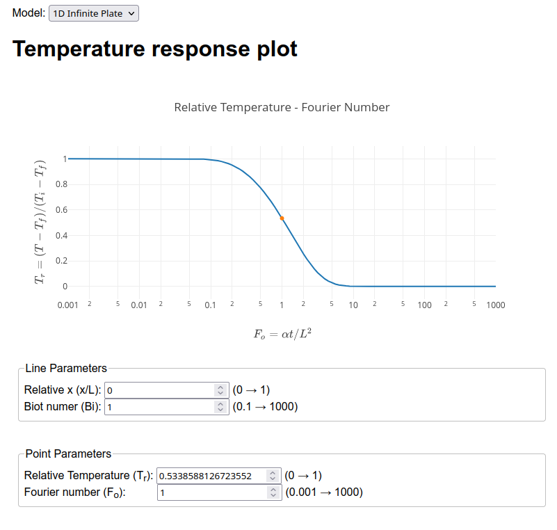

# 1D Heat Diffusion
## Website:
https://qnumnd.github.io/1D-Heat-Diffusion/

## Method:
- Finite difference method of time dependent heat equation with convection boundary condition.
- Missing values are found using linear interpolation of existing data.
